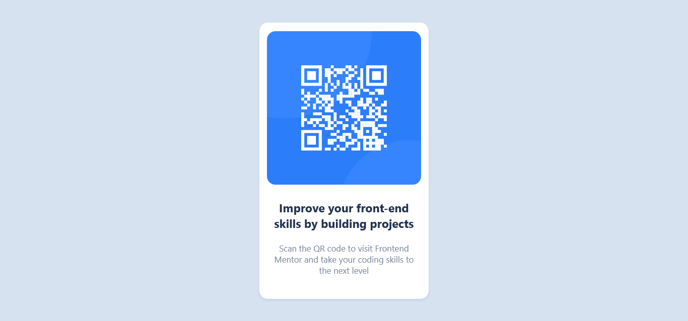

# Frontend Mentor - QR code component solution

This is a solution to the [QR code component challenge on Frontend Mentor](https://www.frontendmentor.io/challenges/qr-code-component-iux_sIO_H). Frontend Mentor challenges help you improve your coding skills by building realistic projects. 

## Table of contents

- [Overview](#overview)
  - [Screenshot](#screenshot)
  - [Links](#links)
- [My process](#my-process)
  - [Built with](#built-with)
  - [What I learned](#what-i-learned)
  - [Continued development](#continued-development)
  - [Useful resources](#useful-resources)
- [Author](#author)

## Screenshot



### Links

- Solution URL: [Github Repository](https://github.com/Pedro-Celeste/qr-code-challenge)

## My process

For a first attempt, I think I did pretty well.

This was the first time that I used a **mobile-first** workflow. It made the developing experience much more interesting.

As a very beginner trying to improve my skills, I'm focusing on making actual projects and only learning technical things when it's necessary.

This ensures I'm using my time more effectively, since I'm not learning tons of information about HTML and CSS that I might or might not use in the future.

### Built with

- Simple HTML5 syntax
- CSS custom properties
- Mobile-first workflow

### What I learned

The main thing I learned during this project was a way to **center elements** on a page both horizontally and vertically (not according to the viewport).

Here's how I did it:

```css
/* Simple class that centers an element inside of its main container */
.center {
  position: absolute;
  top: 50%;
  left 50%;
  transform: translate(-50%, -50%);
}

/* This class positions the top and left edge of the element at the halfway point of the page, then moves it back half the length of the object itself, completely centering it. */
```

### Continued development

Even though this method of centering things that I described above worked pretty well, I'm aware that there are something called **Flexbox** that might be useful to learn in the future as more effective approach.

I'm looking forward to explore more ways of specifying the layout of a page.

### Useful resources

- [How to Center Divs](https://blog.hubspot.com/website/center-div-css) - This helped me understand how I could center the QR Code container in the center of the screen, independent of the width of the viewport.


## Author

- Twitter - [@oPedroCeleste](https://www.twitter.com/oPedroCeleste)
- Frontend Mentor - [@Pedro-Celeste](https://www.frontendmentor.io/profile/Pedro-Celeste)
